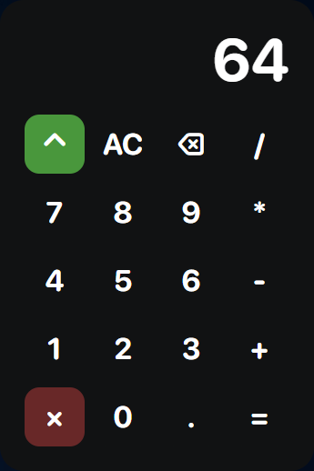
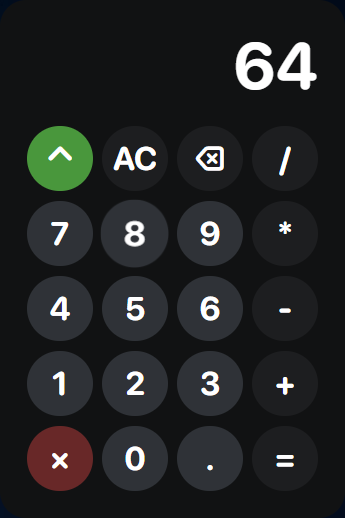
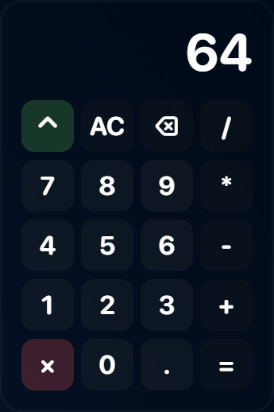
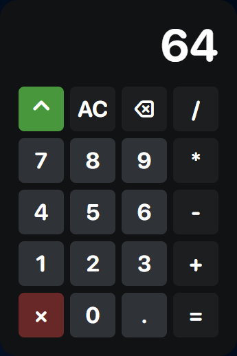

# Calculator

## [Preview](https://web-calculator-tau.vercel.app/)

## Features

### Design

We've created a new design, beautiful and modern design for our app. Fonts, colors and gaps are as modern as possible. Also we've added so much customization options, and we will tell you about them later.

### Keyboard support

You can use keyboard, for all buttons on the calculator. Also, for **⌃ AC ⌫ = ×** buttons we used **Alt Del Backspace Enter Esc** keyboard buttons respectively.

### Customization

We've added a new ⌃ button for changing your settings, just press it, and after that you can customize your calculator, whatever like. With 1 - theme, with 2 - round, with 3 - font size, with 0 - buttons transparency. Also change window size by +- buttons.

## Download

Download last .exe in [releases](https://github.com/lixelv/calculator_app/releases) if you are on windows, and etc for other. Also if you want to lunch app by npm, **do not!**
